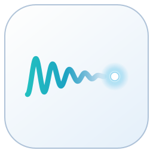

[English](README.md) · [한국어](README.ko.md)

<strong><a href="https://github.com/philaxis/mulbit/releases/latest/download/mulbit.exe">⬇ Windows용 mulbit 받기</a></strong>

말하면, 커서가 있는 자리에 글이 써집니다.

---

**공짜입니다.** 받아서 켜면 끝. 가입도, 결제도 없습니다.

**내 PC 안에서 받아씁니다.** 인터넷이 없어도 되고, 목소리가 밖으로 나가지 않습니다.

**말을 끊지 않습니다.** 말하는 대로 글이 보이고, 내가 멈출 때만 멈춥니다.

**멈추면 바로 들어갑니다.** 채팅창이든 문서든 코딩 도구든, 커서가 있던 그 자리에.

**마우스가 키보드가 됩니다.** 남는 마우스 버튼 하나에 걸어 두세요. 누르고, 말하고, 다시 누르면 입력 끝.

**"물빛" 한마디로 켜고 끕니다.** 내가 정한 말로 시작하고 멈출 수 있습니다.

## 시작하기

1. 위 버튼으로 받아서 실행합니다.
2. 처음 한 번, 음성 모델을 받습니다.
3. `Ctrl+Alt+Space`를 누르고 말한 뒤, 다시 누릅니다.

## 더 정확하게 쓰고 싶다면

설정에 Gemini API 키를 넣으면 Google의 음성 인식으로 받아쓸 수 있습니다. 키는 [Google AI Studio](https://aistudio.google.com/apikey)에서 무료로 받을 수 있고, 사용량은 Google의 무료 한도와 요금을 따릅니다. 이때는 목소리가 Google로 전송됩니다.

자주 묻는 것

**Windows가 실행을 막아요.** 서명이 없는 프로그램이라 처음에 경고가 뜹니다. **추가 정보 → 실행**을 누르세요.

**내 글과 목소리는 어디에 남나요?** 받아쓴 글은 내 PC의 `문서\mulbit` 폴더에만 저장됩니다. 목소리는 저장하지 않습니다.

**단축키를 바꾸고 싶어요.** 설정에서 바꿀 수 있습니다. 마우스 프로그램(Logitech 등)에서 그 단축키를 버튼에 연결하면 됩니다.

**어떤 Windows에서 되나요?** Windows 10과 11.

---

무료로 쓸 수 있습니다. 재배포와 수정은 안 됩니다. [라이선스](LICENSE.md) · [오픈소스 고지](THIRD_PARTY_NOTICES.md) · 의견은 [Issues](https://github.com/philaxis/mulbit/issues)로.

© 2026 philaxis
